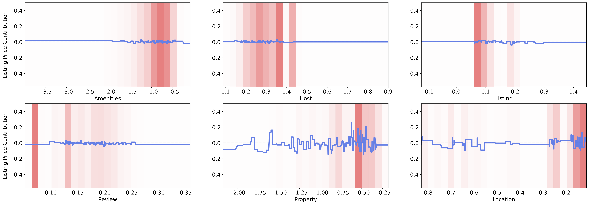
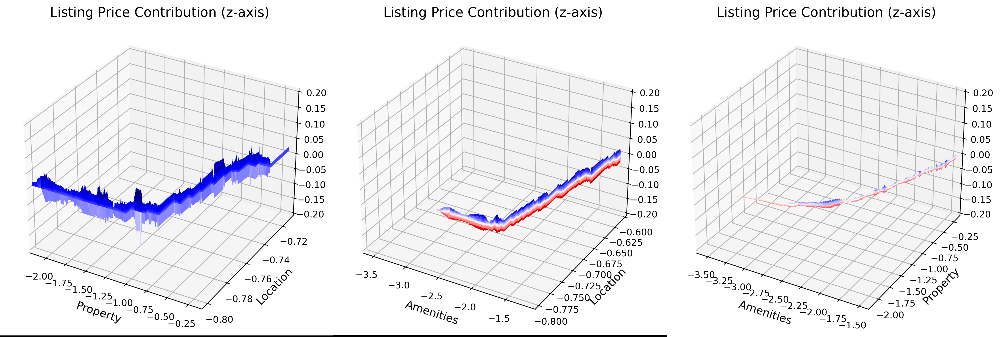

# CAT-KDD-2024
**Figure 1: Shape functions for each first-order input feature learned by the second-order CAT model. The x-axis represents the values of the concepts, while the y-axis indicates the contributions of each value to the listing price. The blue line represent the shape functions for a concept. Pink bars represent the normalized data density for 25 bins of concept values.**

**Figure 2: Shape functions for three most imprtant second-order input feature (Figure 2 in the submission) learned by the second-order CAT model. The x-axis and y-axis represent the values of two concepts that interact with each other, while the y-axis indicates the contributions of each second-order interaction value to the listing price. The blue line represents the shape function for the second-order interaction between two coressponding concepts. Finally, darker shades of blue denote more positive contributions to the price, and darker shades of red indicate more negative contributions.**

