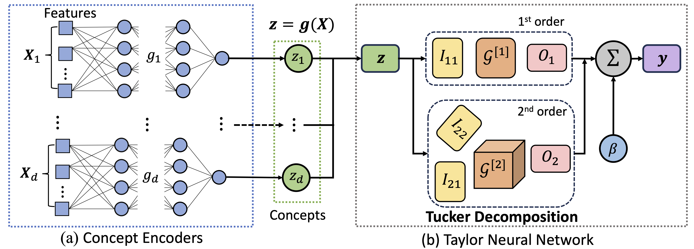

# CAT: Interpretable Concept-based Taylor Additive Models

This repository contains the code for the paper [CAT: Interpretable Concept-based Taylor Additive Models](https://arxiv.org/abs/2406.17931) by [Viet Duong](vqduong@wm.edu), Qiong Wu, Zhengyi Zhou, [Hongjue Zhao](hongjue2@illinois.edu), Chenxiang Luo, Eric Zavesky, Huaxiu Yao, [Huajie Shao](hshao@wm.edu).

## Model Overview
CAT consists of two main components: concept encoders and Taylor Neural Networks (TaylorNet). Each concept encoder embeds a group of low-level features into a one-dimensional high-level concept representation. The TaylorNet is a white-box model that uses the high-level concept representations to make predictions.



## Library Setup
```
git clone https://github.com/vduong143/CAT-KDD-2024.git
cd CAT-KDD-2024
conda create --name CAT python=3.9
conda activate CAT
pip install -r requirements.txt
```

## Datasets
The datasets used in the paper can be obtained from [here](https://drive.google.com/file/d/1mT5-vdhKJgVPZ16WOY-7bFP0IDuxiwJM/view?usp=sharing). The datasets should be placed in the `data` folder.

## Training and Evaluation
Run CAT training and evaluation on Airbnb:
```
bash ./scripts/run_airbnb.sh
```
Run CAT training and evaluation on COMPAS:
```
bash ./scripts/run_compas.sh
```

Run CAT training and evaluation on Diabetes:
```
bash ./scripts/run_diabetes.sh
```

Run CAT training and evaluation on UCI-HAR:
```
bash ./scripts/run_har.sh
```

Run CAT training and evaluation on MNIST:
```
bash ./scripts/run_MNIST.sh
```

Run CAT training and evaluation on CelebA:
```
bash ./scripts/run_CelebA.sh
```

The `gpu` variable should be set to the GPU number you want to use. The random `seed` can be set to desired any integer value. Both variables can be set in the `run_*.sh` scripts (e.g., `run_airbnb.sh`).

## Interpretability Evaluation
The code for visualizing and interpreting the predictions of the CAT (order 2) model can be found in the notebook `CAT_interpretation.ipynb`. Please change the `data_name` variable to the dataset you want to visualize (airbnb or CelebA).

## Citation
If you find this repository useful in your research, please cite the following paper:
```
@inproceedings{duong2024cat,
  title={CAT: Interpretable Concept-based Taylor Additive Models},
  author={Duong, Viet and Wu, Qiong and Zhou, Zhengyi and Zhao, Hongjue and Luo, Chenxiang and Zavesky, Eric and Yao, Huaxiu and Shao, Huajie},
  booktitle={Proceedings of the 30th ACM SIGKDD Conference on Knowledge Discovery and Data Mining},
  year={2024}
}
```

## Acknowledgements
This work was supported in part by the AT&T CDO.