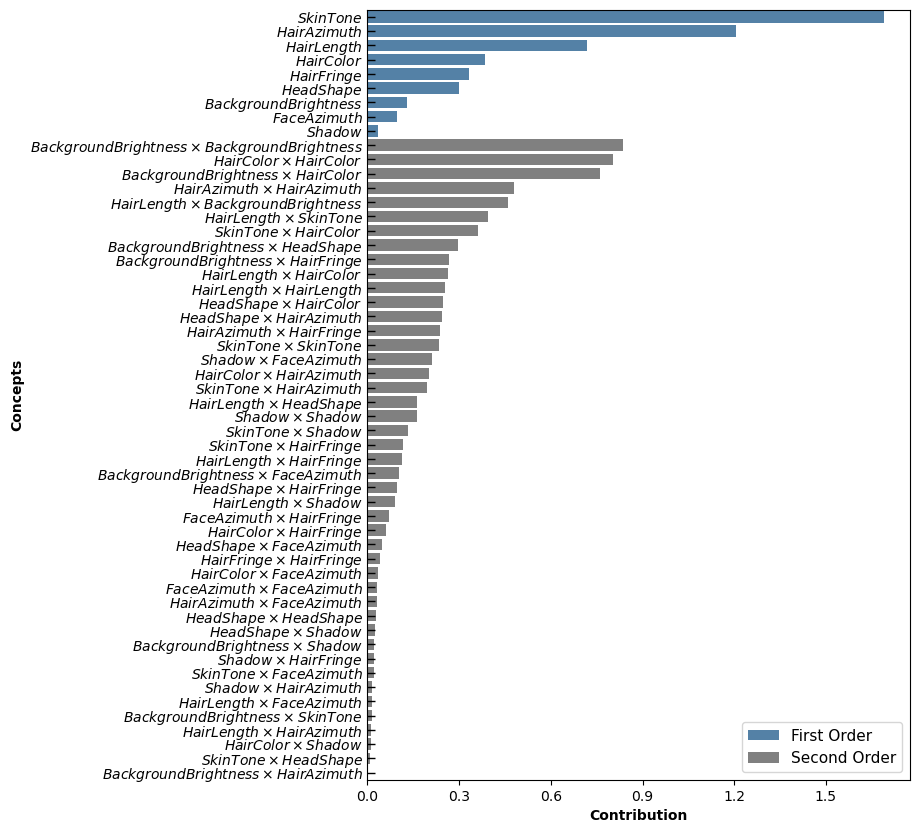
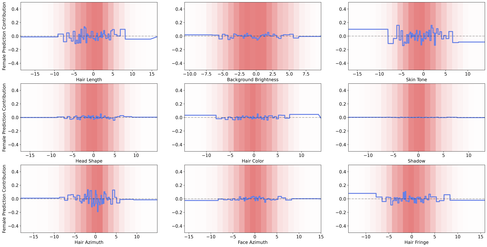

# CAT-KDD-2024
**Figure 1: Shape functions for the first-order concepts learned by the second-order CAT model on the Airbnb dataset. The x-axis represents the values of the concepts, while the y-axis indicates the contributions of each value to the listing price. The blue line represents the shape function for a concept. Pink bars represent the normalized data density for 25 bins of concept values.**

**Figure 2: Shape functions for three most important second-order interactions (Figure 2 in the submission) learned by the second-order CAT model on the Airbnb dataset. The x-axis and y-axis represent the values of two concepts that interact with each other, while the z-axis indicates the contributions of each second-order interaction value to the listing price. The plotted surface represents the shape function for the second-order interaction between two corresponding concepts. Finally, darker shades of blue denote more positive contributions to the price, and darker shades of red indicate more negative contributions.**

**Figure 3: Concept contributions using second-order Taylor for predicting gender on the CelebA dataset. Contributions are given by the standardized regression coefficients of the Taylor polynomial. We observe that the _Skin Tone_, _Hair Azimuth_, and _Hair Length_ concepts influence the gender prediction the most.**

**Figure 4: Shape functions for the first-order concepts learned by the second-order CAT model on the CelebA dataset. The x-axis represents the values of the concepts, while the y-axis indicates the contributions of each value to the prediction of a female person. The blue line represents the shape function for a concept. Pink bars represent the normalized data density for 25 bins of concept values.**

